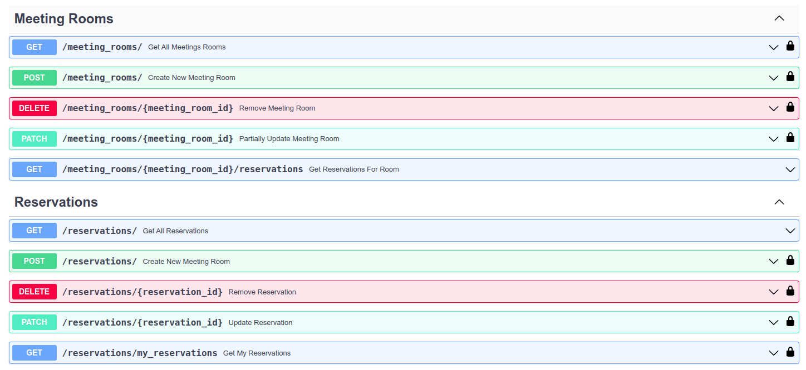

# API сервис для бронирования переговорных комнат 🏢

Учебный проект по разработке API сервиса бронирования переговорных комнат на FastAPI.

Возможности:
1. Создание/обновление пользователя, авторизация при помощи JWT Token.
2. Создание/удаление/изменение переговорных комнат (доступно администратору)
3. Просмотр переговорных комнат и имеющихся по ним бронирований.
4. Бронирование, обновление/удаление бронирований (доступно автору бронирования и администратору)
5. Получение списка имеющихся бронирований и бронирований по пользователю.
6. Получение списка с количеством бронирований переговорок с автоматическим формированием отчета в google-spreadsheets при помощи google.api. После формирования отчет будет автоматически добавлен на ваш google drive.

**Внимание!** Для полноценной работы п.6 потребуется создать сервисный аккаунт google-cloud и получить токен с учетными данными для заполнения .env файла.



## Стек

[![Python][Python-badge]][Python-url]
[![FastAPI][FastAPI-badge]][FastAPI-url]
[![SQLAlchemy][SQLAlchemy-badge]][SQLAlchemy-url]
[![SQLite][SQLite-badge]][SQLite-url]
[![Docker][Docker-badge]][Docker-url]
[![Google cloud][Google-cloud-badge]][Google-cloud-url]
[![Swagger][Swagger-badge]][Swagger-url]

## Установка и запуск (локально)

* Клонировать репозитарий:
```
git clone https://github.com/vavilovnv/room_reservation
```
* Установить и активировать виртуальное окружение:
```
poetry shell
```
* Установить все зависимости:
```
poetry install
```
* Выполнить миграции:
```
alembic upgrade head
```
* Запустить на исполнение main.py
```
python3 ./app/main.py
```
* Открыть страницу документации (http://127.0.0.1:8000/docs) и проверить методы CRUD.

## Установка и запуск (docker)

* Запустить контейнер:
```
sudo docker-compose up -d --build
```
* Открыть страницу документации (http://0.0.0.0:8080/docs) и проверить эндпоинты.

<!-- MARKDOWN BADGES & URLs -->
[Python-badge]: https://img.shields.io/badge/python%203.9+-3670A0?style=for-the-badge&logo=python&logoColor=ffdd54

[Python-url]: https://www.python.org/

[FastAPI-badge]: https://img.shields.io/badge/FastAPI-005571?style=for-the-badge&logo=fastapi

[FastAPI-url]: https://fastapi.tiangolo.com/

[SQLAlchemy-badge]: https://img.shields.io/badge/sqlalchemy-fbfbfb?style=for-the-badge

[SQLAlchemy-url]: https://www.sqlalchemy.org/

[SQLite-badge]: https://img.shields.io/badge/SQLite-07405E?style=for-the-badge&logo=sqlite&logoColor=white

[SQLite-url]: https://sqlite.org/index.html

[Docker-badge]: https://img.shields.io/badge/docker-%230db7ed.svg?style=for-the-badge&logo=docker&logoColor=white

[Docker-url]: https://www.docker.com/

[Swagger-badge]: https://img.shields.io/badge/-Swagger-%23Clojure?style=for-the-badge&logo=swagger&logoColor=white

[Swagger-url]: https://swagger.io/

[Google-cloud-badge]: https://img.shields.io/badge/GoogleCloud-%234285F4.svg?style=for-the-badge&logo=google-cloud&logoColor=white

[Google-cloud-url]: https://cloud.google.com/